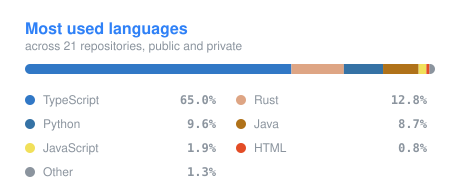

# rxie

**CS @ Northeastern University**

I try to make tools, products, and games

---

### Currently

Making **[convkit](https://github.com/shdwfruit/convkit)**. I didn't want to use online file format converters, and I was using yt-dlp, so it inspired me to make a local file converter that has the ease of yt-dlp. Everyday file conversion that runs entirely on your machine

---

### Tech

**Languages**

    

**Frameworks & infrastructure**

      

---

### Featured

<table>
<tr>
<td width="50%" valign="top">

#### [convkit](https://github.com/shdwfruit/convkit) &nbsp;·&nbsp; Rust &nbsp;·&nbsp; ★4

One command for everyday file conversion. Maps a source and target format onto an expert-tuned invocation of the right backend (ffmpeg, ImageMagick, LibreOffice, pandoc, or Typst) across **115 conversion pairs and 27 formats**.

When the source codecs already fit the target container it remuxes instead of re-encoding: lossless, and measured **3.3×–71.7× faster** plus everything is local.

`Rust` · `ffmpeg` · `Homebrew tap`

</td>
<td width="50%" valign="top">

#### Fogwalk &nbsp;·&nbsp; Python

A fog-of-war map of Tokyo reconstructed from an IRL streamer's walk-and-talk archive. Every route walked on camera permanently reveals a 100 m core and a 250 m halo; the rest of the city stays in fog, and each street links back to the video and timestamp where it was first walked.

There is **no GPS feed**; routes are rebuilt from published video by extracting location evidence from transcripts and frames, geocoding it, and interpolating pedestrian paths between confident anchors using a 10-stage pipeline.

`LLM extraction` · `geocoding` · `ffmpeg` &nbsp;—&nbsp; source private

</td>
</tr>
<tr>
<td width="50%" valign="top">

#### [alltold](https://life-manager-jade-beta.vercel.app) &nbsp;·&nbsp; TypeScript

A multi-dashboard personal organization app. Sign in with Google, pick a template, and fill a single viewport with widgets

React 18 + Vite + Zustand on the front, Express + Drizzle ORM + Neon Postgres behind it, deployed across Vercel and Railway. Check out the landing page, very proud of it.

`React` · `Drizzle` · `Neon` &nbsp;—&nbsp; live demo · source private

</td>
<td width="50%" valign="top">

#### PokéCenter Listener &nbsp;·&nbsp; Python

A desktop app that watches Discord channels for Pokémon product drop alerts (Pokémon Center, Walmart, Costco) and opens the retailer link the moment one appears. It includes queue detection with an instant browser launch.

PySide6 for the dark-themed UI, FastAPI and `discord.py` for the bridge, with license-based device authentication and native notifications on Windows and macOS. Used Pub-Sub architecture with websockets for international reach and fast speed.

`PySide6` · `FastAPI` · `discord.py` &nbsp;—&nbsp; source private

</td>
</tr>
<tr>
<td width="50%" valign="top">

#### [Mastermind](https://github.com/shdwfruit/mastermind) &nbsp;·&nbsp; Java

The classic color-sequence deduction game, written from scratch in a single self-contained Java file. Has board state, guess scoring, and the interactive loop, with no external dependencies.

`Java`

</td>
<td width="50%" valign="top">

#### Also around here

[**frogger**](https://github.com/shdwfruit/frogger) — the arcade classic, built in Racket.

[**concentration**](https://github.com/shdwfruit/concentration) — the memory card game, in Java.

[**apple_website**](https://github.com/shdwfruit/apple_website) — a recreation of Apple's marketing site.

</td>
</tr>
</table>

---

### Languages

